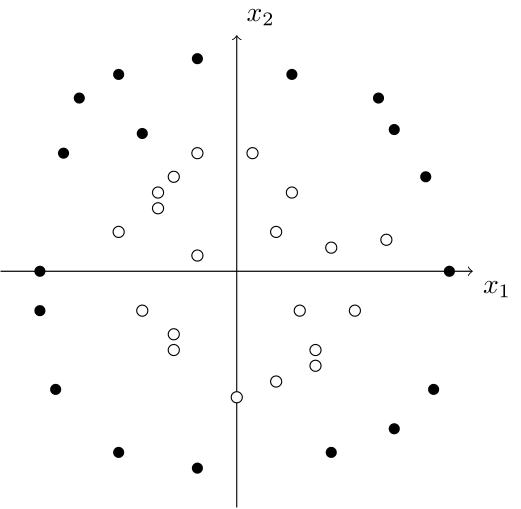
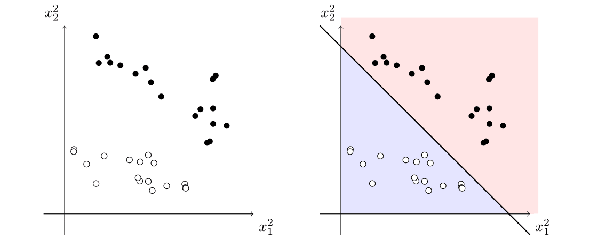
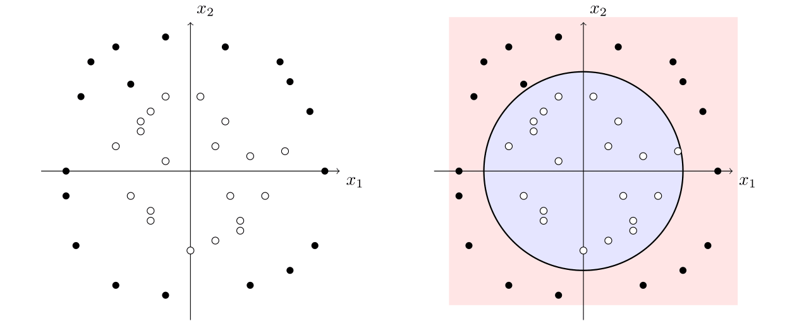

# Talk 5: Kernel methods
### [Alvaro Gonzalez Hernandez](https://alvarogohe.github.io/), 27th May 2025

Kernel methods are a powerful set of techniques in machine learning that are used for building non-linear prediction models.

In previous weeks of the study group, we saw how to construct linear models that allow us to find trends in data. However, as we know, most phenomena that machine learning excels at studying, from image recognition to natural language processing, are inherently non-linear.

Kernels provide a way to solve non-linear problems by transforming them into equivalent problems that can be solved efficiently using linear methods.

## Let's start with an example
A very illustrative example is the following:

Suppose that we want to build a model that allows us to classify data into two categories, and we have the following training data:

We would like to be able to find a curve in the coordinate plane that splits the plane into two regions, one for each category. In this case, it is quite clear that using a line to separate the data is not going to work well, but it seems like this data could be approximated well by a closed shape, for example, a circle.

Now, here is the trick on how to classify the data. Instead of trying to fit a linear model on the data $(x_1,x_2)\in\mathbb{R}^2$, we generate points in $\mathbb{R}^5$ of the form $(x_1,x_2,x_1^2,x_1x_2,x_2^2)$ and try to use a hyperplane to separate the data.

Indeed, just by considering $\{x_1^2,x_2^2\}$, we can easily see that the data can be easily separated with a line:

Now, this line corresponds to a conic in the original space, which separates our original data:

This idea of mapping the data into a higher-dimensional space is the essence of kernel methods. In the exercise session, we will see how to implement them in practice using the `sklearn` library. But let's first explain the theory behind the kernel approach.

## Theoretical background

As in the past, let $(x_i,y_i)\in\mathcal{X}\times\mathcal{Y}$ be a set of training data of size $n$, where $\mathcal{X}\subseteq\mathbb{R}^d$ is the input space and $\mathcal{Y}$ is the output space. Our goal is to learn a function $f\colon\mathcal{X}\to\mathcal{Y}$ that approximates the relationship between the inputs and outputs. 

For today's talk, we will focus on the case where $\mathcal{Y}=\{-1,1\}$, which is the case of binary classification. As $\mathcal{Y}$ is discrete, what we do instead is that we learn a function $f_\theta\colon\mathcal{X}\to\mathbb{R}$ and then, we set $f(x)=\text{sign}(f_\theta(x))$. This function $f_\theta$ is called the **prediction function**, and we will assume that it is a linear function on some parameters $\{\theta_1,\dots,\theta_m\}$. Assume we also have a **loss function** $\ell\colon\mathcal{Y}\times\mathbb{R}\to\mathbb{R}$ that measures how well the prediction function $f_\theta$ fits the data. For example, we can consider the square loss $\ell(y,f_\theta(x))=(y-f_\theta(x))^2$.

Let us now choose a function $\varphi\colon\mathcal{X}\rightarrow\mathbb{R}^m$ that maps the input space $\mathcal{X}$ to a different space $\mathbb{R}^m$. This is what we will call the **feature map**.

Going back to our example, there, we defined the feature map to be

$$\begin{align*}
\mathcal{X}&\longrightarrow \mathbb{R}^3\\
(x_1,x_2)&\longmapsto (x_1^2, x_2^2, 1)
\end{align*}$$

and the function we are trying to learn is $f_\theta(x_1,x_2)=\theta_1 x_1^2 + \theta_2 x_2^2+\theta_3$, for some parameters $\theta_1,\theta_2,\theta_3\in\mathbb{R}$. If we denote by $(x_i,y_i)$ our data, we can write $f_\theta(x_i)$ in terms of the usual inner product as $f_\theta(x_i)=\langle\theta, \varphi(x_i)\rangle$. We would like to find the parameter $\theta=(\theta_1,\dots,\theta_m)\in\mathbb{R}^m$ that minimises what is known as the **empirical risk**:

$$\begin{align}
\frac{1}{n}\sum_{i=1}^n \ell(y_i,\langle\theta, \varphi(x_i)\rangle)+\frac{\lambda}{2}\lVert \theta\rVert^2 \end{align}$$

The first term of this expression represents how close the $f_\theta(x_i)$ are to the correct values in our training data, whereas $\frac{\lambda}{2}\lVert \theta\rVert^2$ is a regularization term that prevents overfitting by penalizing large values of the parameter $\theta$. We can use linear regression to find the parameter $\theta$ that minimises this expression.

## Introducing kernels
From the discussion above, we saw that we can reduce non-linear problems to linear ones by using a feature map $\varphi$.  In practice, there are two issues with this approach:

- We often do not know how to choose a good feature map $\varphi$ and we may need to try several ones before finding one that works well.
- Solving the optimisation problem above can be computationally expensive, especially if the input data has very large dimension. This is something common in many problems, particularly, when we have very sparsely populated data. 

To model mathematically how it is to work with very high dimensional data, we can use Hilbert spaces. Recall that a **Hilbert space** is a vector space (possibly of infinite dimension) with an inner product space that is complete with respect to the norm induced by the inner product.

Assume that $\mathcal{X}$ is a subset of a Hilbert space $\mathcal{H}$, rather than $\mathbb{R}^d$ and that the feature map $\varphi$ is then a function that maps the input space $\mathcal{X}$ to $\mathcal{H}$. One would imagine that solving the optimisation problem given by $(1)$ in this setting is now even more difficult, as we may be working in a space with infinite dimension. But there is a theorem that guarantees that the difficulty of the problem only depends on the number of elements in our training data, not on the size of the input space $\mathcal{X}$:

**Representer Theorem (for supervised learning).** For $\lambda>0$, the infimum of the empirical risk

$$ \inf_{\theta\in\mathcal{H}}\frac{1}{n}\sum_{i=1}^n \ell(y_i,\langle\theta, \varphi(x_i)\rangle)+\frac{\lambda}{2}\lVert \theta\rVert^2$$

can be obtained by restricting to a vector $\theta$ of the form:

$$\theta=\sum_{i=1}^n \alpha_i \varphi(x_i)$$

where $\alpha=(\alpha_1,\dots,\alpha_n)\in\mathbb{R}^n$.

Now, let us define the **kernel function** $k$ to be 

$$\begin{align*}k:\mathcal{X}\times\mathcal{X}&\longrightarrow\mathbb{R}\\
(x,x')&\longmapsto\langle \varphi(x),\varphi(x')\rangle \end{align*}$$

Let $K$ be the **kernel matrix** whose entries are given by $K_{ij}=k(x_i,x_j)$. Then, if we have $\theta=\sum_{i=1}^n \alpha_i \varphi(x_i)$,

$$\langle\theta, \varphi(x_j)\rangle=\sum_{i=1}^n \alpha_i k(x_i,x_j)=(K\alpha)_j$$

and

$$\lVert\theta\rVert^2=\sum_{i=1}^n\sum_{j=1}^n\alpha_i\alpha_j\langle\varphi(x_i),\varphi(x_j)\rangle=\alpha^\top K \alpha $$

so that we can rewrite the optimisation problem as

$$\inf_{\theta\in\mathcal{H}}\frac{1}{n}\sum_{i=1}^n \ell(y_i,\langle\theta, \varphi(x_i)\rangle)+\frac{\lambda}{2}\lVert \theta\rVert^2=\inf_{\alpha\in\mathbb{R}^n}\frac{1}{n}\sum_{i=1}^n \ell(y_i,(K\alpha)_i)+\frac{\lambda}{2}\alpha^\top K \alpha$$

This what is known as the **kernel trick**: instead of working with the feature map $\varphi$, we can work directly with the kernel matrix $K$. This allows us to work with high-dimensional data without having to explicitly compute the feature map $\varphi$. 

As a matter of fact, we can forget about the feature map $\varphi$ altogether and just work with the kernel function $k$, for the following reason:

 We say that a kernel function $k$ is **positive definite**, if for any finite set of points $x_1,\dots,x_n\in\mathcal{X}$, the matrix $K$ restricted to those points is symmetric positive semi-definite. Then, we have this theorem:

**Theorem (Aronszajn, 1950)** The function  $k:\mathcal{X}\times\mathcal{X}\to\mathbb{R}$ is a positive-definite
kernel if and only if there exists a Hilbert space $\mathcal{H}$ and a function $\varphi:\mathcal{X}\rightarrow\mathcal{H}$ such that for all $x,x'\in\mathcal{X}$,  $k(x,x')=\langle \varphi(x),\varphi(x')\rangle$.

Therefore, the existence of a kernel function $k$ is equivalent to the existence of a feature map $\varphi$ in some Hilbert space. For any positive-definite kernel $k$, the space that we build from the kernel is called the **reproducing kernel Hilbert space (RKHS)**. 

There are many other reasons why working with kernels is useful, including the fact that there are very efficient algorithms to compute kernels and solve their optimisation problem.

## Examples of kernels
There are many different kernels that can be used in practice. 
Some of the most common ones are:
<ul>
<li>

**Linear kernel**: $k(x,x')=x^\top x'$, $\forall x,x'\in\mathcal{X}\subseteq\mathbb{R}^d$. 

Here, the kernel trick
can be useful when the input data have huge dimension $d$, but is quite sparse, such as in text processing. </li>

<li>

**Polynomial kernel**: $k(x,x')=(1+x^\top x')^s$, $\forall x,x'\in\mathcal{X}\subseteq\mathbb{R}^d$.

 The image of the feature map is the set of all polynomials on $d$ variables of degree at most $s$.</li>

<li>

**Homogeneous polynomial kernel**: $k(x,x')=(x^\top x')^s$,  $\forall x,x'\in\mathcal{X}\subseteq\mathbb{R}^d$.

 The image of the feature map is the set of degree $s$ homogeneous polynomials on $\mathbb{R}^d$.</li>

<li>

**Radial basis function (RBF) kernel**: $k(x,x')=\exp\left(-\gamma\lVert x-x'\rVert^2\right)$, $\forall x,x'\in\mathcal{X}\subseteq\mathbb{R}^d$.

This kernel is also known as the **Gaussian kernel**, and it is particularly useful in many applications, such as image processing and natural language processing. The parameter $\gamma>0$ controls the boundary of the decision region, in the sense that as $\gamma$ grows, the boundary becomes more complicated and can fit the data better, but it also increases the risk of overfitting.</li>

<li>

**Translation invariant kernels**: $k(x,x')=q(x-x')$, $\forall x,x'\in[0,1]$.  

The idea behind this class of kernels is that the space of square-integrable functions on $[0,1]$ is a Hilbert space with the inner product given by $\langle f,g\rangle=\int_0^1 f(x)g(x)\,dx$. An orthonormal basis of $L_2([0, 1])$ is given by the functions $\sin(2\pi m x)$ and $\cos(2\pi n x)$ for $m,n\in\mathbb{N}$, and we can study many aspects of $q(x)$ from the perspective of Fourier analysis. These kernels are particularly useful in time series analysis, where we can use them to study periodic phenomena (e.g., weather patterns, seasonal financial trends...)
</li>
</ul>

We will see how to work with some of these kernels in practice in the exercise session.

